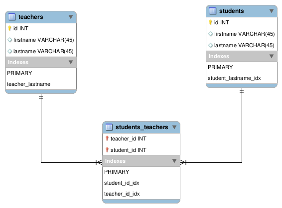

## School App

This project is a simple application with CRUD operations on a simple database. It is used to understand concepts related to:

- Apache Maven
- Service Oriented Architecture (SOA)
- Interactions with a MySQL database
- UI interface

The project is intended for educational purposes.

### Database Schema

Author: Michalis Koutrakis
